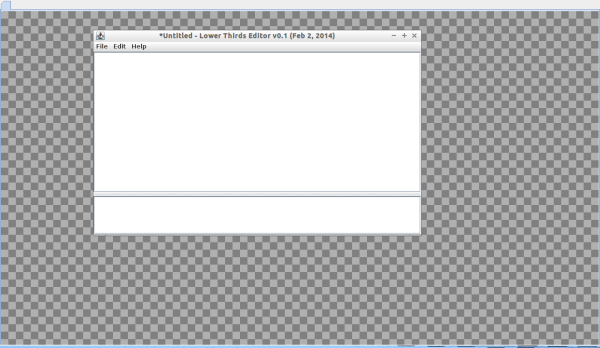
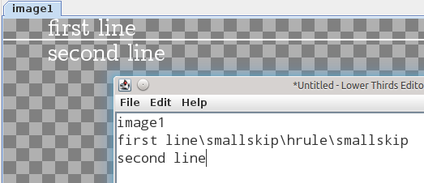
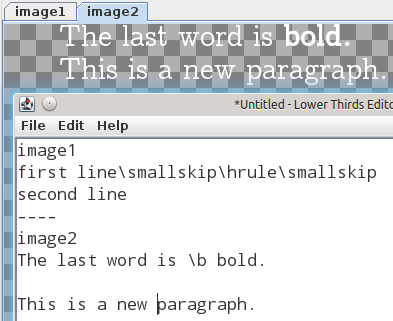

# Introduction

Lower Thirds Editor allows you to add text and simple graphics to a video using a built-in markup language.  Of course, this can be done with any video editor, but there are times when the video editor's graphical interface simply doesn't give you the control that you want or have the feature that you want.  This program lets you create transparent video overlay images (PNG files) using a typesetting markup language to describe the text and graphics in the overlay.

Since the program uses a certain file format and built-in markup language, you need to have a few examples in order to have a sense of how it works.  The big checkered window will be called the "overlays window", and that's where the overlay images will be rendered as you type.  The checkered pattern is just a background to show where the image is transparent, and the degree of opacity.  The editor window, which can be re-sized and moved around as you work, has two panes: the top pane is the actual editor, and the bottom pane displays errors as you type.  Errors won't crash the program (or they shouldn't) - all they do is stop the real time rendering as long as a particular error condition persists.  As you make an error go away by either fixing it or just by continuing to type, the text that you are typing will be immediately rendered again.  So, don't worry about errors, you will see them constantly as you work.

## Installing

If you haven't yet done so, please download the software by clicking on the *Download* link at the top.  If you are on Windows, then it's probably best to just download it to your Desktop.  Their is no special installation procedure for the software itself, other than the fact that it runs on a platform known as the JVM, which you can get (for free) at <http://java.com>.  Just click on *Free Java Download* and follow their installation instructions.  Once the JVM is installed, you will be able to run Lower Thirds Editor, probably just be clicking (or double clicking) on it the way you would run any other program on your computer.  If that doesn't work, you can run the program by starting a command line window (however you do that in the operating system you are using), changing to the directory where you downloaded the program, and typing
	
	java -jar lte.jar

After starting the program you should see

## Getting Started

When you start the program, you see two windows: a large one with a checkered pattern in it, and a smaller one with a menu.  The larger window, referred to as the "overlays window".  That's where you will see a real-time (as you type) preview of the video overlay image you are working on.  The checkered pattern indicates transparency: transparent regions of your image will be indicated by showing the checkered background.  The other window is where you type what goes into your overlay, and will be referred to as the "editor window".

As you type into the editor window, remember that you can move the editor window around as needed to see the changes.  You may now type (copy/paste) the following

	image1
	first line\smallskip\hrule\smallskip
	second line

You should see

Now continue typing the following, beginning on a new line (yes, it starts with four dashes in a row)

	----
	image2
	The last word is \b bold.
	
	This is a new paragraph.
	
You should now see

The two tabs in the overlays window are transparent images with a bit of text in them (that you typed).  We can now export those images to a folder.  So now, make a folder (on your desktop or wherever) and call it whatever you like.  First, you need to save the contents of the editor (i.e. the five lines of text that you just typed) as a text file, so click on File → Save.  In the Save window, go into the folder you created and type a name for the text file (whatever name you would like).  And click on Save.  Now, to export the images to that same folder, click on File → Export.  The two images should now be in the folder.  You should check them with an image viewer, and observe that they are high-def (1280 × 720) mostly transparent images with a bit of white opaque (non-transparent) text in them.

You now have the gist of how this program works.  In the next section we will introduce the markup language, which is called YAML (stands for Yet Another Markup Language).  This should not be confused with another language of the same name [here](http://www.yaml.org/) which serves a completely different purpose.  There is also a nice website framework called YAML at [www.yaml.de](http://www.yaml.de).

## Syntax

